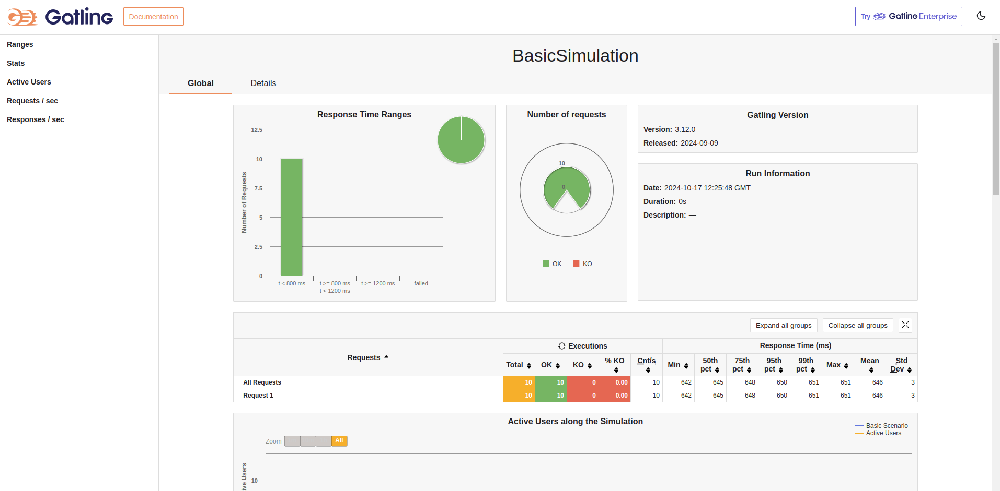

# Gatling Test Suite - Multi-módulo

Este repositório é organizado como um projeto multi-módulo no qual cada módulo representa uma suíte de testes de carga e performance usando Gatling para diferentes repositórios da nossa organização. Cada módulo é configurado individualmente, permitindo a execução de testes personalizados para cada projeto.

## Estrutura do Repositório

```
gatling-test-suite/
├── project-a/
│   ├── src/
│   ├────── simulations/
│   ├── resources/
│   └── build.gradle
├── project-b/
│   ├── src/
│   ├────── simulations/
│   ├── resources/
│   └── build.gradle
├── template/
│   ├── src/
│   ├────── simulations/
│   ├── resources/
│   └── build.gradle
├── global-resources/
│   └── gatling.conf
├── setup.sh
├── run_tests.sh
├── README.md
└── .github/
    └── workflows/
        └── gatling-tests.yml


```

- **Módulos**: Cada diretório (por exemplo, `project-a`, `project-b`) representa um módulo separado com suas próprias simulações e configurações de teste Gatling.
- **Módulo de Template**: A pasta `template/` serve como um modelo para a criação de novos módulos. Quando for criar um novo módulo, copie os itens deste diretório e personalize conforme necessário.
- **Configurações Globais**: A pasta `global-resources/` contém configurações do Gatling compartilhadas entre todos os módulos.
- **Scripts de Automação**: `setup.sh` prepara o ambiente para os testes, enquanto `run_tests.sh` permite a execução de testes de forma modular.

## Adicionando um Novo Módulo de Testes

### Criar um Novo Módulo

1. No IntelliJ IDEA, adicione um novo módulo ao projeto multi-módulo. Nomeie o módulo conforme o repositório correspondente (por exemplo, `project-c`).
2. Copie a estrutura e arquivos do diretório `template/` para o novo módulo.

### Configurar Simulações e Dependências

1. Adicione uma pasta `simulations/` para armazenar os scripts de simulação do Gatling.
2. Inclua um `build.gradle` com as dependências do Gatling.
3. Se necessário, crie um `gatling.conf` específico no módulo, ou utilize as configurações de `global-resources/`.

## Executando Testes

Os testes são executados via terminal no módulo desejado, utilizando o seguinte comando:

```bash
./gradlew gatlingRun

```
## Acessando os Relatórios

Após a execução dos testes, você pode acessar os relatórios gerados `em app/reports/gatling`. 

Para visualizar os relatórios, abra o arquivo `index.html` no seu navegador:


